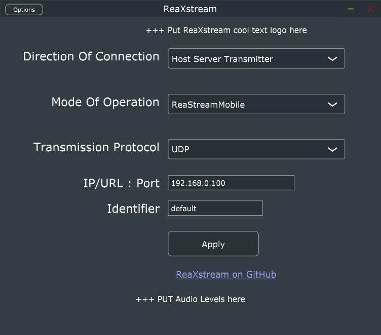

# ReaXstream
Universal VST plug-in & Stand alone application that works in tandem with ReaStreamMobile.
The "ReaXstream" plug-in has a operation mode "ReaXstreamMobile" which is the mode of operation to work with the ["ReaStreamMobile"](https://github.com/JessyJP/ReaStreamMobile) app written entirely in MATLAB.
The prototype for this project is ["ReaStream-Standalone-Application"](https://github.com/JessyJP/ReaStream-Standalone-Application).

TODO: ? SHOULD I Change the mobile app name ["ReaStreamMobile"](https://github.com/JessyJP/ReaStreamMobile) to "ReaXstreamMobile" also?

The puling/Stand-alone application looks like this:

