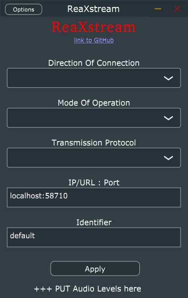

# ReaXstream
Universal VST plug-in & stand-alone application that works in tandem with ReaStreamMobile.
This suits allows you to transfer audio between device or applications as fast as possible.
The "ReaXstream" plug-in has a operation mode "ReaXstreamMobile" which is the mode of operation to work with the ["ReaStreamMobile"](https://github.com/JessyJP/ReaStreamMobile) app written entirely in MATLAB.
The prototype for this project is ["ReaStream-Standalone-Application"](https://github.com/JessyJP/ReaStream-Standalone-Application).

What is important and different for this project?
  + It is cross-platform: Windows, Linux, +[Future TODO: Mac, Arm]
  + Supports Audio and +[Future TODO: MIDI] on for both transmission and reception.
  + Multiple modes and protocols of operation.
  + Is compatible with existing Reaper Reastream from [Reaper](https://www.reaper.fm) or [ReaPlugs VST FX Suite](https://www.reaper.fm/reaplugs/).
  + Supports the Android app ["ReaStreamMobile"](https://github.com/JessyJP/ReaStreamMobile).
  + Supports intercommunication between multiple ASIO devices asynchronously!

Please, check out the [TODO.md](TODO.md) file for current progress on features and bug-fixes.

The puling/Stand-alone application looks like this:

